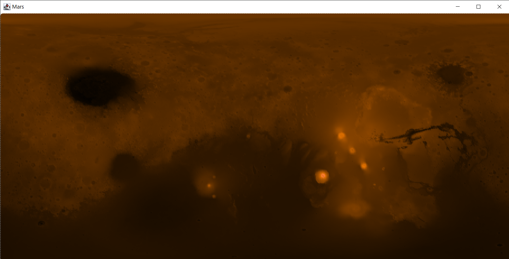

# MarsMap_Java

## Java Swing project to display a map with the surface of Mars

This application reads altitude data from a CSV file and displays a map with that information.
The files in the *data* directory contain data collected during the Mars Global Surveyor Mission which is available at [this website]( https://pds-geosciences.wustl.edu/missions/mgs/megdr.html) 

Three file sizes are provided which allows the map to be rendered faster or with better resolution.
After the altitudes from the CSV file are mapped to longitude and latitude coordinates, each point is rendered in a Java Swing window using shades of brown (darker colours =  lower altitudes)

